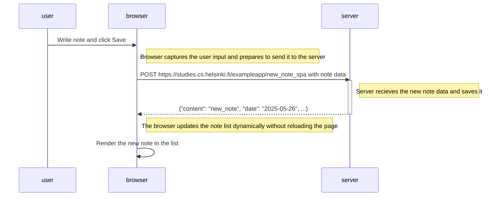

```mermaid

sequenceDiagram
    participant user
    participant browser
    participant server

    user->>browser: Write note and click Save
    Note right of browser: Browser captures the user input and prepares to send it to the server

    browser->>server: POST https://studies.cs.helsinki.fi/exampleapp/new_note_spa with note data
    activate server
    Note right of server: Server recieves the new note data and saves it
    server-->>browser: {"content": "new_note", "date": "2025-05-26", ...}
    deactivate server

    Note right of browser: The browser updates the note list dynamically without reloading the page 

    browser->>browser: Render the new note in the list
```