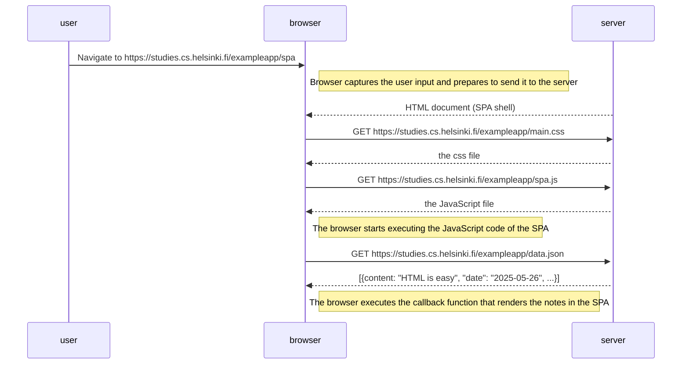

```mermaid

sequenceDiagram
    participant user
    participant browser
    participant server

    user->>browser: Navigate to https://studies.cs.helsinki.fi/exampleapp/spa
    Note right of browser: Browser captures the user input and prepares to send it to the server

    server-->>browser: HTML document (SPA shell)
    browser->>server: GET https://studies.cs.helsinki.fi/exampleapp/main.css
    activate server

    server-->>browser: the css file
    browser->>server: GET https://studies.cs.helsinki.fi/exampleapp/spa.js

    
    server-->>browser: the JavaScript file
    Note right of browser: The browser starts executing the JavaScript code of the SPA
    browser->>server: GET https://studies.cs.helsinki.fi/exampleapp/data.json

    server-->>browser: [{content: "HTML is easy", "date": "2025-05-26", ...}]
    Note right of browser: The browser executes the callback function that renders the notes in the SPA

```